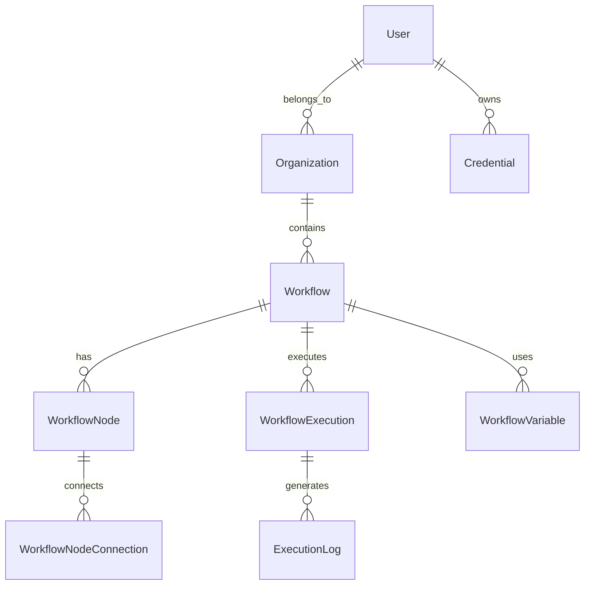

# System Architecture

## Overview

WeConnect follows a **modular, microservices-inspired architecture** built on NestJS, implementing Domain-Driven Design (DDD) principles with clear separation of concerns and dependency injection.

## Architecture Layers

### 1. Presentation Layer
- **Controllers**: Handle HTTP requests and responses
- **Guards**: Authentication and authorization
- **Filters**: Exception handling and error responses
- **Interceptors**: Cross-cutting concerns (logging, transformation)
- **DTOs**: Data validation and serialization

### 2. Application Layer
- **Services**: Business logic implementation
- **Use Cases**: Specific business operations
- **Command/Query Handlers**: CQRS implementation
- **Event Handlers**: Domain event processing

### 3. Domain Layer
- **Entities**: Core business objects
- **Value Objects**: Immutable data structures
- **Domain Services**: Business logic that doesn't belong to entities
- **Repositories**: Data access abstractions
- **Domain Events**: Business event definitions

### 4. Infrastructure Layer
- **Database**: PostgreSQL with TypeORM
- **Cache**: Redis for caching and sessions
- **Message Queue**: Bull/BullMQ for background processing
- **External APIs**: Third-party integrations
- **File Storage**: Local/Cloud storage systems

## Core Components

### Configuration Management

```typescript
// Database Configuration
{
  type: 'postgres',
  host: process.env.DB_HOST || 'localhost',
  port: parseInt(process.env.DB_PORT || '5432', 10),
  username: process.env.DB_USERNAME || 'weconnect',
  password: process.env.DB_PASSWORD,
  database: process.env.DB_DATABASE || 'weconnect',
  entities: [__dirname + '/../**/*.entity{.ts,.js}'],
  migrations: [...],
  synchronize: process.env.NODE_ENV === 'development',
  logging: process.env.NODE_ENV === 'development'
}

// JWT Configuration
{
  secret: process.env.JWT_SECRET || 'your-super-secret-jwt-key',
  expiresIn: process.env.JWT_EXPIRES_IN || '7d'
}

// Redis Configuration
{
  host: process.env.REDIS_HOST || 'localhost',
  port: parseInt(process.env.REDIS_PORT || '6379', 10),
  password: process.env.REDIS_PASSWORD,
  keyPrefix: 'weconnect:',
  bull: {
    prefix: 'bull',
    defaultJobOptions: {
      removeOnComplete: { age: 3600, count: 100 },
      removeOnFail: { age: 86400, count: 500 },
      attempts: 3,
      backoff: { type: 'exponential', delay: 2000 }
    }
  }
}
```

### Core Module Structure

```typescript
@Global()
@Module({
  imports: [ConfigModule, UnifiedNodeExecutionModule],
  providers: [LoggerService, ValidationService, GlobalExceptionFilter],
  exports: [
    LoggerService,
    ValidationService, 
    GlobalExceptionFilter,
    UnifiedNodeExecutionModule
  ]
})
export class CoreModule {}
```

## System Flow

### Request Processing Flow
1. **HTTP Request** → Controller
2. **Authentication** → JWT/API Key validation
3. **Authorization** → Role-based access control
4. **Validation** → DTO validation
5. **Business Logic** → Service layer
6. **Data Access** → Repository pattern
7. **Response** → Serialized DTO

### Workflow Execution Flow
1. **Trigger Event** → Webhook/Schedule/Manual
2. **Queue Job** → Bull/BullMQ processor
3. **Load Workflow** → Database retrieval
4. **Node Execution** → Sequential/Parallel processing
5. **State Management** → Redis caching
6. **Event Broadcasting** → WebSocket notifications
7. **Result Storage** → Database persistence

## Data Architecture

### Database Design Principles
- **Single Responsibility**: Each table serves one purpose
- **Normalization**: Minimize data redundancy
- **Indexing**: Optimized query performance
- **Constraints**: Data integrity enforcement
- **Migrations**: Version-controlled schema changes

### Entity Relationships


## Security Architecture

### Authentication Flow
1. **User Login** → Validate credentials
2. **JWT Generation** → Signed token with user claims
3. **Token Storage** → Client-side secure storage
4. **Request Authentication** → JWT verification
5. **Session Management** → Redis-based sessions

### Authorization Model
- **Role-Based Access Control (RBAC)**
- **Organization-Level Isolation**
- **Resource-Level Permissions**
- **API Key Authentication** for integrations

### Data Security
- **Encryption at Rest**: Sensitive data encryption
- **Encryption in Transit**: HTTPS/TLS
- **Credential Management**: Secure vault storage
- **Audit Logging**: All actions tracked
- **Input Validation**: SQL injection prevention

## Performance Architecture

### Caching Strategy
- **Application Cache**: Redis for frequent queries
- **Session Cache**: User session storage
- **Query Cache**: Database query results
- **Asset Cache**: Static file caching

### Queue Processing
```typescript
// Job Processing Configuration
{
  concurrency: 10,
  removeOnComplete: 100,
  removeOnFail: 500,
  defaultJobOptions: {
    attempts: 3,
    backoff: 'exponential',
    delay: 2000
  }
}
```

### Database Optimization
- **Connection Pooling**: Efficient connection management
- **Query Optimization**: Index-based queries
- **Lazy Loading**: On-demand data fetching
- **Batch Operations**: Bulk data processing

## Scalability Considerations

### Horizontal Scaling
- **Stateless Services**: Session-independent processing
- **Load Balancing**: Request distribution
- **Database Sharding**: Data partitioning
- **Microservice Boundaries**: Independent scaling

### Vertical Scaling
- **Resource Optimization**: Memory and CPU usage
- **Connection Limits**: Database connection management
- **Queue Sizing**: Processing capacity tuning
- **Cache Sizing**: Memory allocation optimization

## Monitoring & Observability

### Application Metrics
- **Request Latency**: Response time tracking
- **Throughput**: Requests per second
- **Error Rates**: Success/failure ratios
- **Resource Usage**: CPU, memory, disk I/O

### Business Metrics
- **Workflow Executions**: Success/failure tracking
- **Node Performance**: Execution time analysis
- **User Activity**: Engagement metrics
- **System Health**: Uptime monitoring

### Logging Strategy
```typescript
// Logger Service Implementation
{
  levels: ['error', 'warn', 'info', 'debug'],
  transports: [
    'console',    // Development
    'file',       // Production logs
    'database'    // Audit trail
  ],
  format: 'json', // Structured logging
  metadata: true  // Request context
}
```

## Integration Architecture

### External Service Integration
- **OAuth2 Flow**: Third-party authentication
- **API Rate Limiting**: Request throttling
- **Webhook Management**: Event-driven integration
- **Retry Mechanism**: Fault tolerance
- **Circuit Breaker**: Failure protection

### Event-Driven Architecture
```typescript
// Event Flow
Trigger → Queue → Processor → Event Bus → Subscribers
```

## Technology Stack

### Core Technologies
- **Runtime**: Node.js 18+
- **Framework**: NestJS 11+
- **Language**: TypeScript 5+
- **Database**: PostgreSQL 12+
- **Cache**: Redis 6+
- **Message Queue**: Bull/BullMQ

### Development Tools
- **ORM**: TypeORM
- **Validation**: class-validator
- **Documentation**: Swagger/OpenAPI
- **Testing**: Jest
- **Linting**: ESLint + Prettier
- **Package Manager**: npm

### Infrastructure
- **Containerization**: Docker
- **Orchestration**: Docker Compose
- **Reverse Proxy**: Nginx
- **Process Manager**: PM2
- **Monitoring**: Custom metrics + health checks

## Design Patterns Used

### Structural Patterns
- **Module Pattern**: Feature organization
- **Repository Pattern**: Data access abstraction
- **Factory Pattern**: Object creation
- **Decorator Pattern**: Cross-cutting concerns

### Behavioral Patterns
- **Observer Pattern**: Event handling
- **Strategy Pattern**: Algorithm selection
- **Command Pattern**: Request encapsulation
- **Chain of Responsibility**: Middleware processing

### Architectural Patterns
- **MVC**: Model-View-Controller
- **CQRS**: Command Query Responsibility Segregation
- **Event Sourcing**: State change tracking
- **Dependency Injection**: Loose coupling

## Error Handling Strategy

### Exception Hierarchy
```typescript
BaseException
├── BusinessException
├── ValidationException
├── AuthenticationException
├── AuthorizationException
└── InfrastructureException
```

### Error Processing Flow
1. **Exception Thrown** → Business logic
2. **Exception Filter** → Global handler
3. **Error Logging** → Structured logging
4. **User Notification** → Appropriate response
5. **Monitoring Alert** → Operations team

## Deployment Architecture

### Environment Separation
- **Development**: Local development
- **Testing**: Automated testing
- **Staging**: Pre-production testing
- **Production**: Live system

### Infrastructure Components
```yaml
Services:
  - API Server (Node.js)
  - Database (PostgreSQL)
  - Cache (Redis)
  - Queue Processor (Bull)
  - Reverse Proxy (Nginx)
  - File Storage (Local/S3)
```

This architecture provides a solid foundation for a scalable, maintainable, and secure workflow automation platform.
